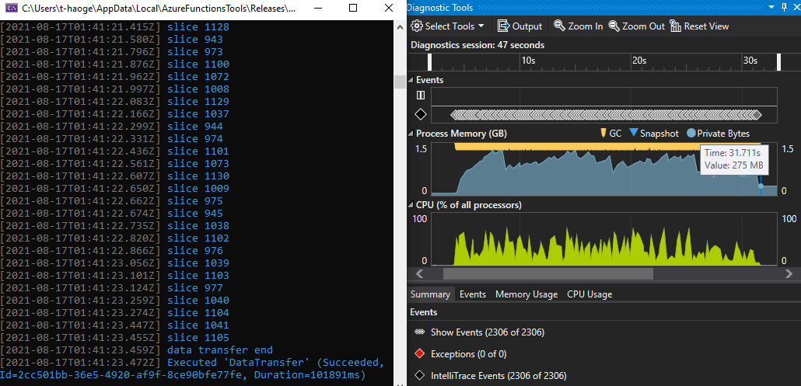

# Performance Test Doc

#### Sequential Execute

about 1min13s, low cpu utilization

#### Parallel Sync Execute, no Channel

MaxDegreeOfParallelism = 10

about 32s, high cpu utilization

#### Parallel Async Execute, no Channel

MaxDegreeOfParallelism = 10

about 29s, high cpu utilization

#### Parallel Async Execute, with Channel

##### channel bounded: bad performance

channel bound = 100

reader threads num = 8, writer threads num = 10

about 2min26s! low cpu utilization

Why does the performance drop so much after adding channels to separate the reader and writer threads? It would be seen that the CPU utilization rate cannot continue to maintain high occupancy, which is different from the previous cases, such as "parallel sync execute" and "parallel async execute without channel". Obviously due to the use of channels, some resources and some threads are blocked.

I try to set the reader thread num = 1, writer thread num = 1,  the senario would be close to the sequential case, but it even takes about 4min14s! 

##### channel bounded: better performance

**Obviously the speed of consumption cannot keep up with the speed of production, resulting in congestion of resources.**

so I adjust the thread num: **make writer threads more than reader threads**

5 reader threads and 10 writer threads, costs about 1min

8 reader threads and 15 writer threads, costs about 58s

You will find that the overall cpu and memory occupancy are more balanced.

##### channel unbounded: better performance

I also try to unlimit the channel capacity, that is: channel bound = ∞

8 reader threads and 15 writer threads, costs about 54s

#### Analysis

Although the "parallel async with channel " is more time-consuming than parallel methods without channel, but it still performs better than the sequential method, and It will bring some benefits we are more hopeful of:  

- **Decoupling** reader and writer by using the channel can be more conducive to **expansion** and **separation** of read and write. 

- The most important thing is that the number of reader threads and writer threads can be **independently controlled**. And then we can **control the memory usage** to keep it at a low level. So we just 

  eg: the memory usage with channel is mostly around 300MB, but if it's without channel, the memory usage will rise to 1-2GB.

So we only sacrificed a part of the speed performance brought by parallelism (still faster than serial), but finally we can gain the control of memory usage. The former is the optimization of the system, and the latter is the bottleneck of our entire system, which is also the problem we more expectantly to solve.

By the way, I also try to analyze the influence of the channel, there are two main aspects should be taken into account:

- The reader -> channel -> writer process will definitely take longer than the direct reader->writer process, but the performance loss is worth the decoupling and scalability. It can be seen from the final tuning results that it can be still faster than the serial method.
- When the channel is full, the writer's consumption capacity cannot keep up with the reader's production capacity. At this time, the asynchronous thread of the reader is blocked and cannot push data into the channel, then the task cannot be ended. Assume that none of the total 10 parallel threads are released, no one can come to read new IO data, that is why the CPU occupancy rate suddenly drops in the last figures.

